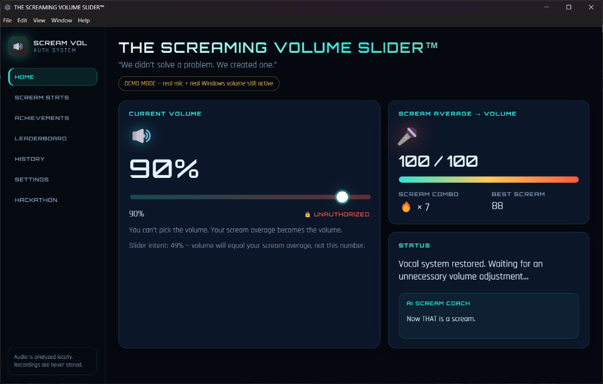
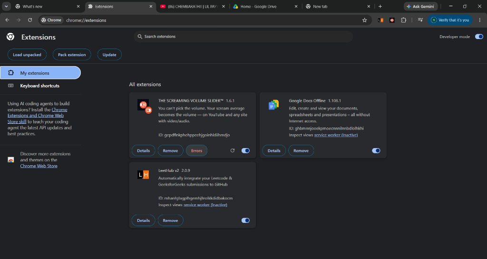
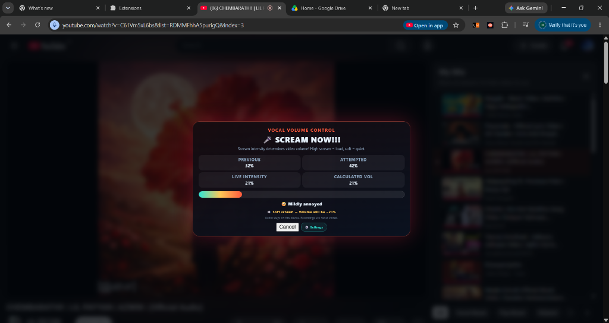
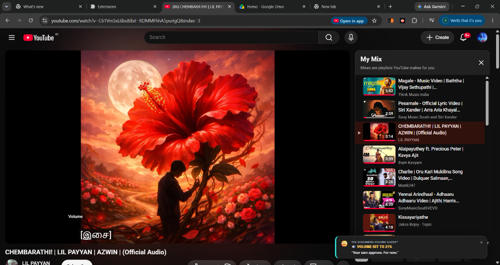

# THE SCREAMING VOLUME SLIDER™ 🔊🎤

## Basic Details

### Team Name: Screamer

### Team Members

* Team Lead: Nisthul krishna

### Project Description

A Chrome extension (plus optional Windows Electron app) that looks like serious biometric audio-security tech — but the only way to change volume is to scream. **Your scream sound level directly becomes the video volume.**

Works while watching **YouTube** and other sites with video/audio: when you try to change the player volume, you get roasted for your request, then the scream overlay appears. High scream = high volume, soft scream = low volume.

### The Problem (that doesn't exist)

Traditional volume controls require almost zero physical effort. Changing volume is far too easy, quiet, and socially acceptable.

### The Solution (that nobody asked for)

Voice-activated physical effort authorization. Try to change volume → get roasted → scream into your microphone → the extension measures scream intensity and dynamically sets the video volume to your **scream sound level** (0–100%). Louder screaming → louder volume. Soft screaming → lower volume. Whispering or low sound is rejected.

---

## Technical Details

### Technologies/Components Used

For Software:

* JavaScript / HTML / CSS
* **Chrome Extension (Manifest V3)** — primary for YouTube / web video
* Electron (optional Windows desktop app for system master volume)
* Web Audio API (real-time microphone intensity & RMS analysis)
* Custom sensitivity calibration engine & live audio score mapping
* Page-world volume hook on `HTMLMediaElement.prototype.volume`
* `loudness` (Electron only — Windows master volume)

---

## Chrome extension (YouTube / any video site)

### Install (unpacked)

1. Open Chrome → `chrome://extensions`
2. Enable **Developer mode**
3. Click **Load unpacked**
4. Select the `chrome-extension` folder in this repo
5. Open YouTube (or Netflix, etc.), play a video, and try to change the volume (slider, mute, or `ArrowUp` / `ArrowDown` keys)
6. Allow microphone when prompted
7. Scream — your scream sound level becomes the video volume

### Settings & Configuration

Click the extension icon or click the **⚙️ Settings** button inside the scream overlay to customize:

* **Extension Active**: Toggle ON/OFF to temporarily restore normal volume control
* **🎚️ Mic Sensitivity Slider**: Adjust from `0.20x` (Hardcore Roar) to `2.00x` (Soft Mic / Whisper Mode)
* **⏱️ Scream Duration**: Choose `2.0s (Fast)`, `3.5s (Standard)`, or `5.0s (Long)`
* **😈 Pre-Scream Roast**: Toggle the volume-based roast briefing ON/OFF
* **🔄 Reset Defaults**: Instantly reset all controls to default settings

### How it works

1. An injected page script hooks `HTMLMediaElement.volume` and intercepts volume changes on YouTube/web players.
2. Intercepts slider drag, mute click, scroll, and `ArrowUp` / `ArrowDown` / `M` keypresses.
3. The extension overlay opens, delivers a volume roast, then listens on the mic for the configured duration (~3.5s default).
4. Scream intensity (0–100%) is calculated in real-time from RMS/peak audio data using your chosen sensitivity multiplier.
5. Calculated scream volume level is applied directly to the video player with post-scream toast notifications.
6. Mic access stops immediately after.

### Project structure

```
chrome-extension/
  manifest.json   # MV3 extension manifest
  inject.js       # runs in page world — hooks video/audio volume & keys
  content.js      # scream overlay + mic analysis + in-overlay settings
  content.css     # overlay styles + toast notifications
  popup.html/js   # popup UI + sensitivity & preference controls
  icons/          # extension icons
```

---

## Electron desktop app (optional — Windows system volume)

```bash
npm install
npm start
```

Build exe:

```bash
npm run build
```

This version controls **Windows master volume** (not just the browser tab).

```
electron/     # main process + volume control
renderer/     # desktop UI
```

---

### Project Demo

#### Screenshots


*Desktop App — Master Volume Control Interface*


*Chrome Extension v1.6.1 Loaded in Developer Mode*


*Live Scream Analysis Overlay on YouTube*


*Volume Applied Toast Notification after Scream Verification*

# Video

_Add your demo video link here_

## Team Contributions

* Nisthul: Full stack — Chrome extension, Electron app, scream analysis, volume control, sensitivity engine, settings UI

---

Made with ❤️ at TinkerHub Useless Projects

> **“We didn’t solve a problem. We created one.”**

## Privacy

Microphone is used **only** during scream mode. Audio is analyzed locally in your browser. Recordings are never stored or transmitted.
